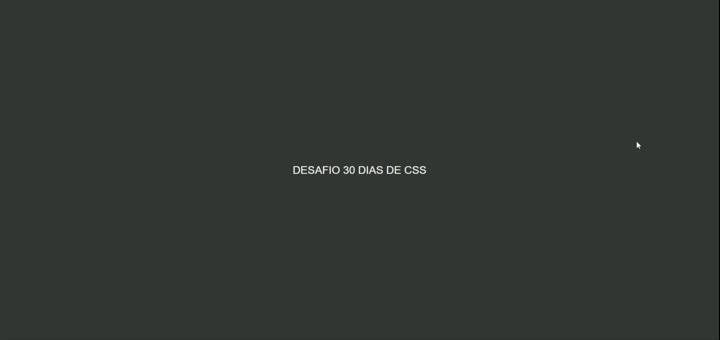
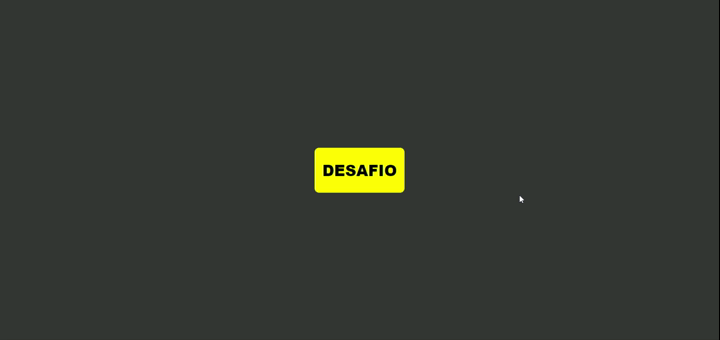

# 🚀 30diasDeCSS 🚀

Hi Devs, beleza? 🖖

# Objetivo

30 dias de CSS3 é um desafio que aceitei (e você também pode participar) e estou inicinando hoje 28 de Julho de 2020, que visa melhorar minhas habilidades em HTML5 e CSS3 através da realização de mini projetos.

# Regras gerais

- Realizar ao menos um projeto por dia;
- Compartilhar seu progresso nas mídias sociais (Twitter, Facebook, Linkedin etc.) usando a hashtag #30diasDeCSS;
- O projeto deve ser concluído até 23:59 de cada dia.

#### Youtube Referencias dos desafios

[Online Tutorials](https://www.youtube.com/channel/UCbwXnUipZsLfUckBPsC7Jog) -
[Creative Creations](https://www.youtube.com/channel/UCOKmVksbzoKJKmtu7rlEM1A) -
[DarkCode](https://www.youtube.com/channel/UCD3KVjbb7aq2OiOffuungzw)

Você pode mandar suas duvidas anonimamente por [AQUI](https://forms.gle/rsK6rhKNTyFgAYYa7)

- [Dia 01 - Ícone de mídia social em camadas](#id01)
- [Dia 02 - Loader animado](#id02)
- [Dia 03 - Mudança de cor de texto quando entra em outra div](#id03)
- [Dia 04 - Botão Animado](#id04)
- [Dia 05 - Botão Efeito Pulse](#id05)

---

## Desafio dia 01 - Ícone de mídia social em camadas 

[Meu codigo](./Desafios/dia01)

[Post LinkedIn](https://www.linkedin.com/posts/williamjesusdev_30diasdecss-html-html5-activity-6693909392074543105-7p1C)

##### O que eu aprendi

- _Criar as camadas utilizando a tag ``_
- _tranformação 2D ou 3D de um elemento [aqui](https://www.w3schools.com/cssref/css3_pr_transform.asp)_
- _[Transições CSS](https://www.w3schools.com/css/css3_transitions.asp)_
- _[Opacidade / transparência do CSS](https://www.w3schools.com/css/css_image_transparency.asp)_
- _[hover](https://www.w3schools.com/cssref/sel_hover.asp)_
- _[nth-child ()](https://www.w3schools.com/cssref/sel_nth-child.asp)_

## Desafio dia 02 - Loader animado 

[Meu código](./Desafios/dia02)

[Post LinkedIn](https://www.linkedin.com/posts/williamjesusdev_30diasdecss-html-html5-activity-6694383670268063744-egRK)

##### O que eu aprendi

- _[animations](https://www.w3schools.com/css/css3_animations.asp)_

## Desafio dia 03 - Mudança de cor de texto quando entra em outra div 

[Meu código](./Desafios/dia03)

[Post LinkedIn](https://www.linkedin.com/posts/williamjesusdev_30diasdecss-html-html5-activity-6694783541324070912-3Krs)

##### O que eu aprendi

- _[overflow](https://www.w3schools.com/css/css_overflow.asp)_
- _[positions](https://www.w3schools.com/css/css_positioning.asp)_
- _[animations](https://www.w3schools.com/css/css3_animations.asp)_

## Desafio dia 04 - Botão Animado 

[Meu código](./Desafios/dia04)

[Post LinkedIn](https://www.linkedin.com/posts/williamjesusdev_30diasdecss-html-html5-activity-6695148503905120256-unf5)

##### O que eu aprendi

- _[inline-block](https://www.w3schools.com/css/css_inline-block.asp)_
- _[svg](https://www.w3schools.com/graphics/svg_intro.asp)_
- _[svg rectangle](https://www.w3schools.com/graphics/svg_rect.asp)_

## Desafio dia 05 - Botão Efeito Pulse 

[Meu código](./Desafios/dia05)

[Post LinkedIn](https://www.linkedin.com/posts/williamjesusdev_30diasdecss-html-html5-activity-6695472301879656448-Iqfp)

##### O que eu aprendi

- _[variables](https://www.w3schools.com/css/css3_variables.asp)_
- _[animations](https://www.w3schools.com/css/css3_animations.asp)_
- _[rgba colors](https://www.w3schools.com/css/css3_colors.asp#:~:text=RGBA%20COLORS)_
